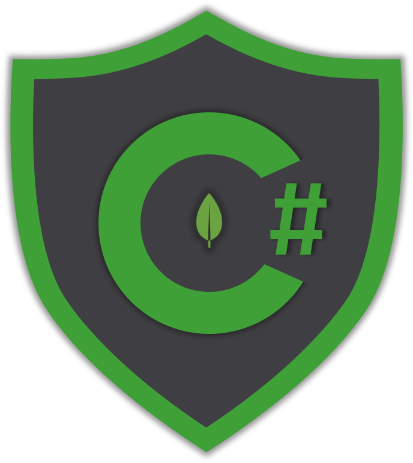

# ⭐ Introduction

## ℹ About the docs

MongoDB has been evolved dramatically over the years 💪 resulting more developers of many different languages and backgrounds, to be attracted to it. While there are official MongoDB [drivers](https://docs.mongodb.com/ecosystem/drivers/) for many different languages, many developers find kind of difficult to solve their problems based on each driver's reference or API. 

These MongoDB C\# driver docs have been created for one purpose and one purpose only - to **bridge the gap between MongoDB and C\# developers** 👏. You will find numerous samples solving problems all developers facing on a daily basis.




These docs don't intend to replace the official MongoDB C\# Driver [reference](https://mongodb.github.io/mongo-csharp-driver/) but instead act as a complementary reference. Also, the _C\#_ samples in the MongoDB [docs](https://docs.mongodb.com/) are written using **`BsonDocument`** which is not ideal for _C\#_ developers


## ❓ How to read the docs

It depends on what your are looking for. In case this is the very first time your are dealing with MongoDB using the [C\# driver](https://docs.mongodb.com/ecosystem/drivers/csharp/) then you should definitely read the entire Getting Started section.

On the other hand, in case you already have some experience with the driver and you simply want to find a sample that may help you solve your problem, just search for it. 

### ✨ Samples

All pages contain some introductory theory to get the reader on the right context. For all samples the solutions are presented in 3 different ways:

* Using the C\# driver in typed manner
* Using the C\# driver with `BsonDocument` which is a schema-less way to build MongoDB queries
* Using the pure MongoDB shell commands

This way you can always compare the shell commands with the .NET code used.


The main goal of the docs is to learn you how to use the C\# driver in a **typed** way using your C\# class models and avoiding the generic `BsonDocument`. While you can easily build any MongoDB query you want with the schema-less way, it's way too ugly plus you will face problems when changing/renaming your model properties, thus it's not recommended.


The code for solving a specific case will look like this:



```csharp
// get a collection reference
var collection = database
    .GetCollection<User>(collectionName);
    
// 1st filter definition (equality)
var maleFilter = Builders<User>.Filter
    .Eq(u => u.Gender, Gender.Male);

// 2nd filter definition (equality)    
var doctorFilter = Builders<User>.Filter
    .Eq(u => u.Profession, "Doctor");

// combine filters    
var maleDoctorsFilter = Builders<User>
    .Filter.And(maleFilter, doctorFilter);

// get results
var maleDoctors = await collection
    .Find(maleDoctorsFilter).ToListAsync();
```



```csharp
var bsonCollection = database
    .GetCollection<BsonDocument>(collectionName);
    
var bsonMaleFilter = Builders<BsonDocument>
    .Filter.Eq("gender", Gender.Male);
    
var bsonDoctorFilter = Builders<BsonDocument>
    .Filter.Eq("profession", "Doctor");
    
var bsonMaleDoctorsFilter = Builders<BsonDocument>
    .Filter.And(bsonMaleFilter, bsonDoctorFilter);
    
var bsonMaleDoctors = await bsonCollection
    .Find(bsonMaleDoctorsFilter).ToListAsync();
```



```javascript
db.users.find({
    $and: [{
        profession:
            { $eq: "Doctor" }
    },
    { gender: { $eq: 0 } }]
})

----------------------------

// sample result

/* 1 */
{
	"_id" : ObjectId("5e9d578781f29c3b1c22d756"),
	"gender" : 0,
	"firstName" : "John",
	"lastName" : "Pouros",
	"userName" : "John.Pouros",
	"avatar" : "https://s3.amazonaws.com/uifaces/faces/twitter/axel/128.jpg",
	"email" : "John29@yahoo.com",
	"dateOfBirth" : ISODate("1999-12-26T02:49:38.625+02:00"),
	"address" : {
		"street" : "3493 Beer Unions",
		"suite" : "Apt. 435",
		"city" : "West Ewell",
		"state" : "Massachusetts",
		"zipCode" : "93115",
		"geo" : {
			"lat" : 21.9856,
			"lng" : 136.1137
		}
	},
	"phone" : "1-938-915-9412",
	"website" : "thad.biz",
	"company" : {
		"name" : "Carroll, Kutch and Harber",
		"catchPhrase" : "User-centric 4th generation core",
		"bs" : "innovate rich users"
	},
	"salary" : 4853,
	"monthlyExpenses" : 4742,
	"favoriteSports" : [
		"Ice Hockey"
	],
	"profession" : "Doctor"
}
```



```csharp
public class User
{
    [BsonId]
    [BsonIgnoreIfDefault] // required for replace documents 
    public ObjectId Id { get; set; }
    public Gender Gender { get; set; }
    public string FirstName {get; set; }
    public string LastName {get; set; }
    public string UserName {get; set; }
    public string Avatar {get; set; }
    public string Email {get; set; }
    public DateTime DateOfBirth {get; set; }
    public AddressCard Address {get; set; }
    public string Phone {get; set; }
    
    [BsonIgnoreIfDefault]
    public string Website {get; set; }
    public CompanyCard Company {get; set; }
    public decimal Salary { get; set; }
    public int MonthlyExpenses { get; set; }
    public List<string> FavoriteSports { get; set; }
    public string Profession { get; set; }
}
```



As you can see, the solution is presented in 3 different ways. If any other code snippet is required it will be added through a new tab.


* The **C\#** tab will always contain the typed way of querying MongoDB
* The **Bson** tab contains the code using `BsonDocument`
* The **Shell** contains the code you would write directly in a MongoDB shell, following with sample results. This tab may also contain some documents directly from the database to get an idea of their schema

> Other than these tabs, samples might also contain result documents or the C\# class models used in the queries


### Repository

All samples of the docs are part of the [mongodb-csharp](https://github.com/chsakell/mongodb-csharp) repository. Each sample is fully isolated and can be tested as long you have setup a local MongoDB server. Also, docs\` structure matches the solution's file and folder structure so that you can easily spot and run the sample you are interested in. What sample runs when you fire the console app, depends on what sample is activated in the _**appsettings.json**_ file.



```javascript
{
  "Samples": {
    "QuickStart_AccessDatabases": false,
    "QuickStart_AccessCollections": false,
    "QuickStart_InsertDocuments": false,
    "QuickStart_ReadDocuments": false,
    "QuickStart_UpdateDocuments": false,
    "QuickStart_DeleteDocuments": false,
    "Crud_Insert_OrderedInsert": true, // this sample will fire
    "Crud_Insert_WriteConcern": false,
    "Crud_Read_Basics": false,
    "Crud_Read_Query_ComparisonOperators": false,
    "Crud_Read_Query_LogicalOperators": false,
    "Crud_Read_Query_ElementOperators": false,
    "Crud_Read_Query_EvaluationOperators": false,
    "Crud_Read_Query_ArrayOperators": false,
    "Crud_Update_BasicOperators": false,
    "Crud_Update_ReplaceDocuments": false,
    "Crud_Update_UpdatingArrays": false,
    "Aggregation_Stages_Match": false,
    "Aggregation_Stages_Group": false,
    "Aggregation_Stages_Projection": false,
    "Aggregation_Stages_Unwind": false,
    "Aggregation_Stages_Bucket": false,
    "Aggregation_Stages_Limit_Skip": false
  }
}
```



According to the above configuration when the app fires, the samples that will run are inside the _OrderedInsert.cs_ file in the _Crud/Insert_ folder.


Avoid running multiple samples simultaneously 🚫 . Each sample usually starts with dropping the database to be used and adding a banch of documents _\(sometimes 500 documents\)_ to a collection.


## 👨💻 How to contribute

The docs are being updated 🔃 as soon as new samples are available or new MongoDB driver's features are released. Contribution is highly welcomed as long as it fulfills the following criteria:

* **Request a new sample**: You can open a new issue at the repository's [issues](https://github.com/chsakell/mongodb-csharp/issues) page, as long as there isn't a related one already. Make sure you have done your search either in the docs or the source code before opening the issue. Last but not least, add some sample data to explain exactly what you are looking for.
* **Fix a sample's code**: Fork the repository 🍴 , create and send a pull request.

