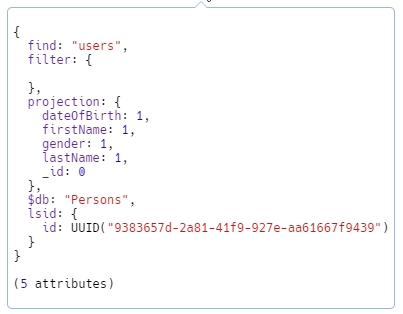

# ✂ Project

## Include and Exclude

You can use a projection stage into your pipeline to either exclude existing fields or add new ones. The type of the final result is a `BsonDocument`.

To use the projection stage you use a `ProjectionDefinitionBuilder<T>` and start excluding or including fields. The end result is a instance of `ProjectionDefinition<T>`. Finally, you use it after the Find method since the `IFindFluent` interface allows you to call multiple methods in a **chain**.



```csharp
// Create a ProjectDefinition<T>

var definition = Builders<T>.Projection
    .Exclude(doc => doc.<field1>)
    .Include(doc => doc.<field2>)
    ...
    .Include(doc => doc.<fieldN>)
    
// Get results
var simpleProjectionResults = await usersCollection
    .Find(Builders<User>.Filter.Empty)
    .Project(simpleProjection) // projection stage
    .ToListAsync();
```



The sample uses a projection stage to re-format `User` documents by excluding the _Id_ field and only include the _Gender_ and _DateOfBirth_. 




```csharp
var collection = database.GetCollection<User>(collectionName);

// exclude id, return only gender and date of birth
var simpleProjection = Builders<User>.Projection
    .Exclude(u => u.Id)
    .Include(u => u.Gender)
    .Include(u => u.DateOfBirth);

var simpleProjectionResults = await usersCollection
    .Find(Builders<User>.Filter.Empty)
    .Project(simpleProjection)
    .ToListAsync();
```




```csharp
var bsonCollection = database
            .GetCollection<BsonDocument>(collectionName);

var bsonSimpleProjection = Builders<BsonDocument>.Projection
    .Exclude("_id")
    .Include("gender")
    .Include("dateOfBirth");

var bsonSimpleProjectionResults = await bsonCollection
    .Find(Builders<BsonDocument>.Filter.Empty)
    .Project(bsonSimpleProjection)
    .ToListAsync();
```



```javascript
db.users.aggregate()
    .project({_id: 0, gender: 1, dateOfBirth: 1})

--------------------------- 
        
// sample result
{
	"gender" : 0,
	"dateOfBirth" : ISODate("1972-04-08T20:56:03.950+02:00")
}
```



```csharp
public class User
{
    [BsonId]
    [BsonIgnoreIfDefault] // required for replace documents 
    public ObjectId Id { get; set; }
    public Gender Gender { get; set; }
    public string FirstName {get; set; }
    public string LastName {get; set; }
    public string UserName {get; set; }
    public string Avatar {get; set; }
    public string Email {get; set; }
    public DateTime DateOfBirth {get; set; }
    public AddressCard Address {get; set; }
    public string Phone {get; set; }
    
    [BsonIgnoreIfDefault]
    public string Website {get; set; }
    public CompanyCard Company {get; set; }
    public decimal Salary { get; set; }
    public int MonthlyExpenses { get; set; }
    public List<string> FavoriteSports { get; set; }
    public string Profession { get; set; }
}
```




While you don't have to explicitly exclude all the fields you don't want to include in the final result, you do have to do it for the identifier field **`_id`**, otherwise it will be included in the result.



## Include custom fields

You can use projection to include new custom calculated fields in the final result.  

The sample uses a projection stage to re-format `User` documents and project the following new fields:

1. _**fullName**_: equal to _firstName_ and _lastName_ concatenated
2. _**fullNameUpper**_: equal to fullName in upper case
3. _**gender**_: equal to the string value of the Gender enum
4. _**age**_: equal to current year minus the _dateOfBirth'_s field year




```csharp
var collection = database.GetCollection<User>(collectionName);

var customProjection = Builders<User>.Projection.Expression(u =>
    new
    {
        fullName = $"{u.FirstName} {u.LastName}",
        fullNameUpper = ToUpperCase($"{u.FirstName} {u.LastName}"),
        gender = u.Gender.ToString(),
        age = DateTime.Today.Year - u.DateOfBirth.Year
    });

var results = await collection.Find(Builders<User>.Filter.Empty)
    .Project(customProjection)
    .ToListAsync();

// private method    
private string ToUpperCase(string value)
{
    return value.ToUpper();
}
```




```javascript
// sample result
{
  "fullName": "Calvin Lindgren",
  "fullNameUpper": "CALVIN LINDGREN",
  "gender": "Male",
  "age": 21
}
```



```csharp
public class User
{
    [BsonId]
    [BsonIgnoreIfDefault] // required for replace documents 
    public ObjectId Id { get; set; }
    public Gender Gender { get; set; }
    public string FirstName {get; set; }
    public string LastName {get; set; }
    public string UserName {get; set; }
    public string Avatar {get; set; }
    public string Email {get; set; }
    public DateTime DateOfBirth {get; set; }
    public AddressCard Address {get; set; }
    public string Phone {get; set; }
    
    [BsonIgnoreIfDefault]
    public string Website {get; set; }
    public CompanyCard Company {get; set; }
    public decimal Salary { get; set; }
    public int MonthlyExpenses { get; set; }
    public List<string> FavoriteSports { get; set; }
    public string Profession { get; set; }
}
```




The driver didn't build any complex query to the MongoDB database, instead it created a projection with the fields used in the projection stage and their values used to build the new anonymous result for each document retrieved




## Projection with LINQ

If you want the driver to create the exact query that matches your projection you can build the query using an **`IMongoQueryable<T>`** reference. There are some limitation though: you cannot use any custom C\# functions you want as you did using a `ProjectDefinition<T>`, but only those function that are supported by the driver. You can get an `IMongoQueryable<T>` ****reference by calling the `AsQueryable` method on a `IMongoCollection<T>` reference.

> **Syntax**: `IMongoCollection<T>.AsQueryable()`




```csharp
// get an IMongoQueryable<T> reference
var usersQueryableCollection = personsDatabase
    .GetCollection<User>(usersCollectionName)
    .AsQueryable();

// 'select new' creates a projection stage
var linqSimpleProjection = 
    from u in usersQueryableCollection
    select new
    {
       fullName = u.FirstName + " " + u.LastName,
       gender = u.Gender == Gender.Male ? "Male" : "Female",
       age = DateTime.Now.Year - u.DateOfBirth.Year
    };

var linqSimpleProjectionResults = 
    await linqSimpleProjection.ToListAsync();
```




```javascript
// query created by the driver

db.users.aggregate([
{ "$project" : 
    { 
        "lastName" : { "$concat" : ["$firstName", " ", "$lastName"] }, 
        "gender" : { 
            "$cond" : [{ "$eq" : ["$gender", 0] }, "Male", "Female"] 
         }, 
        "age" : { "$subtract" : [2020, { "$year" : "$dateOfBirth" }] }, 
        "_id" : 0 
    } 
}])

---------------------
// sample results

/* 1 */
{
	"lastName" : "Natasha Predovic",
	"gender" : "Female",
	"age" : 46
},

/* 2 */
{
	"lastName" : "Natasha Dooley",
	"gender" : "Female",
	"age" : 45
}

```



```csharp
public class User
{
    [BsonId]
    [BsonIgnoreIfDefault] // required for replace documents 
    public ObjectId Id { get; set; }
    public Gender Gender { get; set; }
    public string FirstName {get; set; }
    public string LastName {get; set; }
    public string UserName {get; set; }
    public string Avatar {get; set; }
    public string Email {get; set; }
    public DateTime DateOfBirth {get; set; }
    public AddressCard Address {get; set; }
    public string Phone {get; set; }
    
    [BsonIgnoreIfDefault]
    public string Website {get; set; }
    public CompanyCard Company {get; set; }
    public decimal Salary { get; set; }
    public int MonthlyExpenses { get; set; }
    public List<string> FavoriteSports { get; set; }
    public string Profession { get; set; }
}
```




This time the driver did built the exact query defined in the projection stage but if you try to use a custom C\# function despite the fact it compiles you will get a runtime error.

```csharp
var linqSimpleProjection = 
    from u in usersQueryableCollection
   select new
   {
       fullName = u.FirstName + " " + u.LastName,
       fullNameUpper = // this will cause an exception
           ToUpperCase($"{u.FirstName} {u.LastName}"),
       gender = u.Gender == Gender.Male ? "Male" : "Female",
       age = DateTime.Now.Year - u.DateOfBirth.Year
   };
```

Exception: **`System.NotSupportedException: ToUpperCase of type MongoDb.Csharp.Samples.Aggregation.ProjectionStage is not supported in the expression tree value(MongoDb.Csharp.Samples.Aggregation.ProjectionStage).ToUpperCase(Format("{0} {1}", {document}{firstName}, {document}{lastName})).`**


