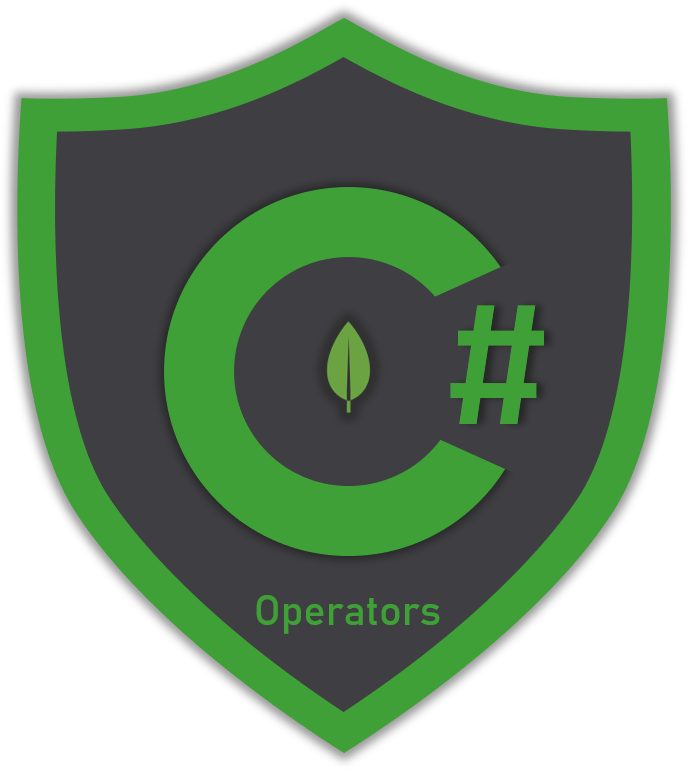

# 🔎 Read

## Finding documents

Building MongoDB queries using the `.NET C# driver` can be sometimes a difficult task to accomplish. The syntax in .NET isn't exactly the same as in the shell but it's always recommended that you build and run the query first on the shell. Next, create your .NET query and compare it with the one in the shell. 

Luckily the driver supports and contains most of the MongoDB query operators that can help you build complex queries that match your criteria. In this section you will learn how to use the following:

* Comparison Operators
* Logical Operators
* Element Operators
* Array operators
* Bitwise Operators
* Comment Operator
* Geo-spatial Operators

