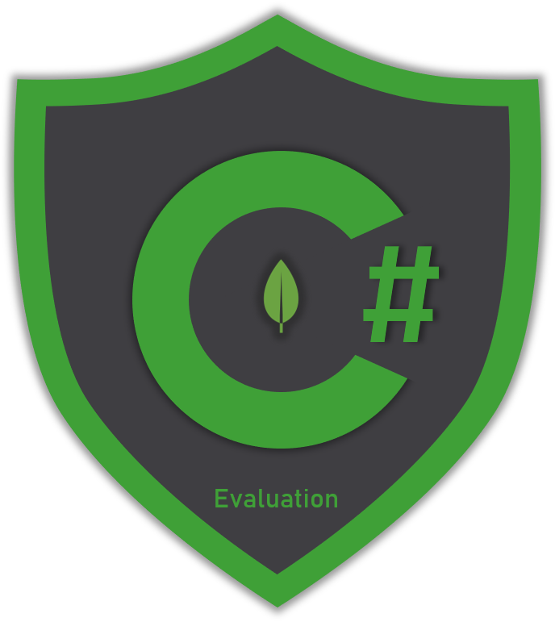

# Evaluation Operators

## Overview

Evaluation operators are used to match documents based on some type of evaluation applied on the field values, for example,  find all documents that one of their field values matches a specified **Regex** pattern. The evaluation applied on this example is to check if a field's value matches the regex pattern given.

| Operator | Description |
| :--- | :--- |
| **Regex** | Find documents where their field values match a specified regular expression |



## _Regex_ operator _- $regex_

The _Regex_ operator is used when you want to match documents based on a regular expression. The regular expression is evaluated to one or more specified document fields. The **$regex** operator can be created via the driver by creating a `FilterDefinition` with the **`Regex`** function. Then use this filter definition in the `IMongoCollection<T>.Find` method.



```csharp
Builders<User>.Filter
    .Regex(doc => doc.<field>, 
        new BsonRegularExpression(<regex-expression>))
```



The sample finds all `User` documents that their email field contains the _"gmail_" word. It does this by evaluating if there's a match between the email field and the regular expression, which by the way can be as complex as you wish.




```csharp
var collection = database
    .GetCollection<User>(Constants.UsersCollection);

// create a regular expression
var gmailFilter = Builders<User>.Filter
    .Regex(u => u.Email, 
    new BsonRegularExpression("/gmail/"));
    
var gmailUsers = await collection
    .Find(gmailFilter).ToListAsync();
```




```csharp
var bsonCollection = database
    .GetCollection<BsonDocument>(Constants.UsersCollection);

// create a regular expression
var bsonGmailFilter = Builders<BsonDocument>
    .Filter.Regex("email", 
        new BsonRegularExpression("/gmail/"));

var bsonGmailUsers = await bsonCollection
    .Find(bsonGmailFilter).ToListAsync();
```



```javascript
db.users.find({"email": { $regex : /gmail/ }})

--------------------

// sample result

{
   "_id": ObjectId("5eabe30dad09da9765850250"),
   "gender":1,
   "firstName":"Lee",
   "lastName":"Carroll",
   "userName":"Lee.Carroll33",
   "avatar":"https://s3.amazonaws.com/uifaces/faces/twitter/hasslunsford/128.jpg",
   "email":"Lee.Carroll@gmail.com", // matched here
   "dateOfBirth":"ISODate("1957-02-25T12:56:15.974Z")",
   "address":{
      "street":"2303 Braxton Gardens",
      "suite":"Apt. 313",
      "city":"Greenfeldermouth",
      "state":"Delaware",
      "zipCode":"21308-0693",
      "geo":{
         "lat":-79.4473,
         "lng":-150.5346
      }
   },
   "phone":"544-623-0642",
   "company":{
      "name":"Little and Sons",
      "catchPhrase":"Adaptive neutral capability",
      "bs":"drive integrated technologies"
   },
   "salary":"NumberDecimal("1275")",
   "monthlyExpenses":2201,
   "favoriteSports":[
      "Golf",
      "Tennis",
      "Water Polo",
      "American Football",
      "Formula 1",
      "Cycling",
      "Table Tennis",
      "Boxing",
      "Volleyball",
      "Basketball"
   ],
   "profession":"Pilot"
}
```



```csharp
public class User
{
    [BsonId]
    [BsonIgnoreIfDefault] // required for replace documents 
    public ObjectId Id { get; set; }
    public Gender Gender { get; set; }
    public string FirstName {get; set; }
    public string LastName {get; set; }
    public string UserName {get; set; }
    public string Avatar {get; set; }
    public string Email {get; set; }
    public DateTime DateOfBirth {get; set; }
    public AddressCard Address {get; set; }
    public string Phone {get; set; }
    
    [BsonIgnoreIfDefault]
    public string Website {get; set; }
    public CompanyCard Company {get; set; }
    public decimal Salary { get; set; }
    public int MonthlyExpenses { get; set; }
    public List<string> FavoriteSports { get; set; }
    public string Profession { get; set; }
}
```




MongoDB uses Perl compatible regular expressions version 8.42 with **UTF-8** support


