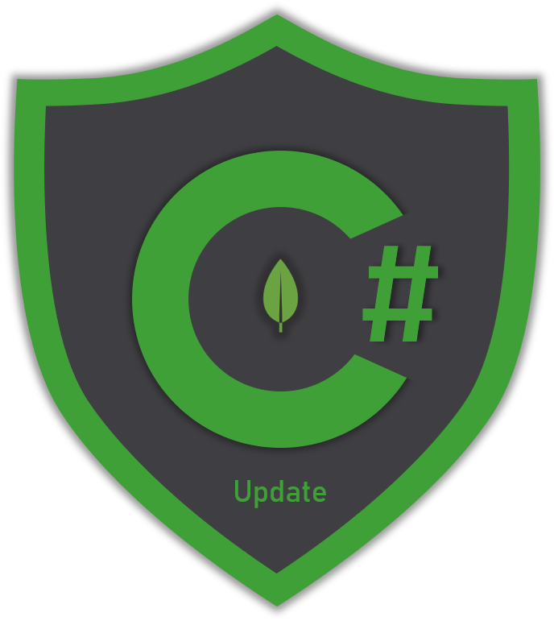

# 📝 Update

## Overview

MongoDB provides a set of update operators to help you update values on your collections' documents. This section contains several samples showing how to use these operators to update:

* Top level fields
* Embedded fields
* Array fields 


Complex update operations such as updating embedded fields, adding or removing items in embedded array fields might be straight forward when building the queries in the _Shell_ but not so much when using the MongoDB C\# driver


The section contains samples for the following operators:

| Operator | Description |
| :--- | :--- |
| **Set** | Sets the value of a field in a document |
| **Inc** | Increments a field's value |
| **Min** | Updates a field's value only if the specified value is **less** than the existing |
| **Max** | Updates a field's value only if the specified value is **greater** than the existing |
| **Mul** | Multiplies a field's value by a specified amount |
| **Unset** | Removes the specified field from the document |
| **Rename** | Renames a field |

Other than the update operations there are also samples showing how to **replace** documents and **array** fields.



## Update Definition Builder 💪 

To create update operations using the MongoDB C\# driver you need to create one or more **update definitions**. The syntax to create an update definition is the following:

> **Syntax**: `Builders<T>.Update.<Operator>(<field>,<value>)`


🧙 An update definition can be the result of more than 1 update definitions on the same document which means you can build a query that updates multiple fields using different operators.

Here's' an example: 

> ```csharp
> var multiUpdateDefinition = Builders<User>.Update
>     .Set(u => u.Phone, "123-456-789") // update 1
>     .Inc(u => u.Salary, 300) // update 2
>     .Set(u => u.FavoriteSports, 
>         new List<string> 
>         { "Soccer", "Basketball" }); // update 3
> ```


## UpdateOne & UpdateMany

To update one or more documents use the **`UpdateOne`** and ``**`UpdateMany`** `IMongoCollection<T>` respectively.

> **Syntax**: `IMongoCollection<T>.UpdateOne(<filter>,<update-definition>)`

> **Syntax**: `IMongoCollection<T>.UpdateMany(<filter>,<update-definition>)`


Update methods return information ℹregarding total documents matched by the filter, total documents modified and if there was acknowledgement

```javascript
{
	"acknowledged" : true,
	"matchedCount" : 1,
	"modifiedCount" : 1
}
```


