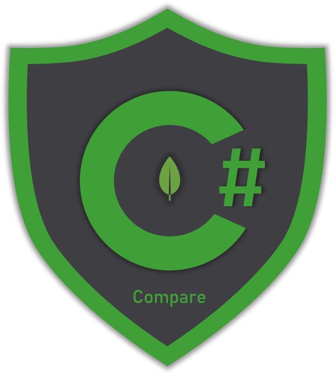

# Comparison Operators

## Overview

Comparison operators are probably the most used operators when querying any type of database provider. MongoDB provides a set of operators 🛠 that can cover all type of comparisons you might need for your queries. This section presents samples for the following **query operators**:

* **Equal** operator
* **Not Equal** operator
* **Greater Than** operator
* **Greater Than or Equal** operator
* **Less Than** operator
* **Less Than or Equal** operator
* **In** operator
* **Not In** operator



## 

## Equal operator

The _equal operator_ is used to match documents having a field value equal to a specific value. You can use it for both top level and embedded documents.

> **Syntax**: `Builders<T>.Filter.Eq(doc => doc.<field>, <value>)`

The sample uses an _equal_ operator to find all documents that have the _profession_ field _\(top level field\)_ equal to "_Pilot_".




```csharp
var collection = database.GetCollection<User>(collectionName);

// Case sensitive!
var equalPilotsFilter = Builders<User>.Filter
    .Eq(u => u.Profession, "Pilot");

var pilots = await collection
    .Find(equalPilotsFilter).ToListAsync();
```




```csharp
var bsonCollection = database.GetCollection<BsonDocument>(collectionName);

// Case sensitive matters!  
var bsonEqualPilotsFilter = Builders<BsonDocument>.Filter
    .Eq("profession", "Pilot");
    
var bsonPilots = await bsonCollection
    .Find(bsonEqualPilotsFilter).ToListAsync();
```



```javascript
db.users.find({profession: { $eq: "Pilot"}})
// or..
db.users.find({profession: "Pilot"})
```



```javascript
// sample matched document
{
	"_id" : ObjectId("5e91e3ba3c1ba62570a67b97"),
	"gender" : 0,
	"firstName" : "Gilbert",
	"lastName" : "Beer",
	"userName" : "Gilbert43",
	"avatar" : "https://s3.amazonaws.com/uifaces/faces/twitter/lingeswaran/128.jpg",
	"email" : "Gilbert_Beer@yahoo.com",
	"dateOfBirth" : ISODate("1950-06-07T20:53:27.758+02:00"),
	"address" : {
		"street" : "3952 Felicita Garden",
		"suite" : "Suite 048",
		"city" : "North Pasqualefort",
		"state" : "Kansas",
		"zipCode" : "56191",
		"geo" : {
			"lat" : -0.8177,
			"lng" : -154.6886
		}
	},
	"phone" : "(973) 473-1826 x2746",
	"website" : "virgie.net",
	"company" : {
		"name" : "Quigley, Mitchell and McGlynn",
		"catchPhrase" : "Multi-layered holistic moratorium",
		"bs" : "enable front-end markets"
	},
	"salary" : 3028,
	"monthlyExpenses" : 3080,
	"favoriteSports" : [
		"Cycling",
		"MMA",
		"Boxing",
		"Handball",
		"Snooker",
		"American Football",
		"Volleyball",
		"Water Polo",
		"Beach Volleyball",
		"Ice Hockey",
		"Motor Sport",
		"Tennis",
		"Formula 1"
	],
	"profession" : "Pilot" // matched here
}
```



```csharp
public class User
{
    [BsonId]
    [BsonIgnoreIfDefault] // required for replace documents 
    public ObjectId Id { get; set; }
    public Gender Gender { get; set; }
    public string FirstName {get; set; }
    public string LastName {get; set; }
    public string UserName {get; set; }
    public string Avatar {get; set; }
    public string Email {get; set; }
    public DateTime DateOfBirth {get; set; }
    public AddressCard Address {get; set; }
    public string Phone {get; set; }
    
    [BsonIgnoreIfDefault]
    public string Website {get; set; }
    public CompanyCard Company {get; set; }
    public decimal Salary { get; set; }
    public int MonthlyExpenses { get; set; }
    public List<string> FavoriteSports { get; set; }
    public string Profession { get; set; }
}
```



## Not Equal operator

When you want to match all document that certain field\(s\) values **are not equal** to a specific value then you use the `Not Equal` operator. 

> **Syntax**: `Builders<T>.Filter.Ne(doc => doc.<field>, <value>)`

The sample uses a _not equal_ operator to match all documents that their _profession_ field is other than "_Doctor_".




```csharp
var collection = database.GetCollection<User>(collectionName);

var notEqualDoctorsFilter = Builders<User>.Filter
    .Ne(u => u.Profession, "Doctor");
    
var notDoctors = await collection
    .Find(notEqualDoctorsFilter).ToListAsync();
```




```csharp
var bsonCollection = database.GetCollection<BsonDocument>(collectionName);

var bsonNotEqualDoctorsFilter = Builders<BsonDocument>.Filter
            .Ne("profession", "Doctor");
            
var bsonNotDoctors = await bsonCollection
            .Find(bsonNotEqualDoctorsFilter).ToListAsync();
```



```javascript
db.users.find({profession: { $ne: "Doctor"}})
```



```javascript
// sample matched document
{
	"_id" : ObjectId("5e91e3ba3c1ba62570a67b95"),
	"gender" : 0,
	"firstName" : "Ronnie",
	"lastName" : "Weissnat",
	"userName" : "Ronnie.Weissnat",
	"avatar" : "https://s3.amazonaws.com/uifaces/faces/twitter/dactrtr/128.jpg",
	"email" : "Ronnie.Weissnat61@gmail.com",
	"dateOfBirth" : ISODate("1981-03-23T18:39:37.569+02:00"),
	"address" : {
		"street" : "48091 Hazle Trafficway",
		"suite" : "Suite 355",
		"city" : "South Fayeburgh",
		"state" : "New Hampshire",
		"zipCode" : "77588",
		"geo" : {
			"lat" : 19.3213,
			"lng" : 19.1313
		}
	},
	"phone" : "719-576-6815 x76397",
	"website" : "grayce.org",
	"company" : {
		"name" : "Davis Inc",
		"catchPhrase" : "Mandatory maximized attitude",
		"bs" : "grow clicks-and-mortar eyeballs"
	},
	"salary" : 2578,
	"monthlyExpenses" : 2986,
	"favoriteSports" : [
		"Darts",
		"Tennis",
		"MMA",
		"Snooker",
		"Handball",
		"Ice Hockey",
		"Boxing",
		"American Football",
		"Beach Volleyball",
		"Volleyball",
		"Cycling",
		"Baseball"
	],
	"profession" : "Lawyer" // matched here
}
```



```csharp
public class User
{
    [BsonId]
    [BsonIgnoreIfDefault] // required for replace documents 
    public ObjectId Id { get; set; }
    public Gender Gender { get; set; }
    public string FirstName {get; set; }
    public string LastName {get; set; }
    public string UserName {get; set; }
    public string Avatar {get; set; }
    public string Email {get; set; }
    public DateTime DateOfBirth {get; set; }
    public AddressCard Address {get; set; }
    public string Phone {get; set; }
    
    [BsonIgnoreIfDefault]
    public string Website {get; set; }
    public CompanyCard Company {get; set; }
    public decimal Salary { get; set; }
    public int MonthlyExpenses { get; set; }
    public List<string> FavoriteSports { get; set; }
    public string Profession { get; set; }
}
```



## Greater Than operator

The _greater than_ operator is used to find all documents that the field value is **greater than** a specific value.

> **Syntax**: `Builders<T>.Filter.Gt(doc => doc.<field>, <value>)`

The sample finds all user documents having their _salary_ field **greater than** 3500.




```csharp
var collection = database.GetCollection<User>(collectionName);

var filterGreaterThan = Builders<User>.Filter
    .Gt(u => u.Salary, 3500);

var greaterThan3500 = await collection
    .Find(filterGreaterThan).ToListAsync();
```




```csharp
var bsonCollection = database.GetCollection<BsonDocument>(collectionName);

var bsonFilterGreaterThan = Builders<BsonDocument>
            .Filter.Gt("salary", 3500);

var bsonGreaterThan3500 = await bsonCollection
            .Find(bsonFilterGreaterThan).ToListAsync();
```



```javascript
db.users.find({salary: { $gt: 3500}})
```



```javascript
// sample matched document
{
	"_id" : ObjectId("5e91e3ba3c1ba62570a67b98"),
	"gender" : 0,
	"firstName" : "Spencer",
	"lastName" : "Swift",
	"userName" : "Spencer.Swift",
	"avatar" : "https://s3.amazonaws.com/uifaces/faces/twitter/daykiine/128.jpg",
	"email" : "Spencer61@hotmail.com",
	"dateOfBirth" : ISODate("1955-01-08T04:19:35.543+02:00"),
	"address" : {
		"street" : "9336 Walker Crest",
		"suite" : "Suite 144",
		"city" : "South Tate",
		"state" : "South Carolina",
		"zipCode" : "46603",
		"geo" : {
			"lat" : 39.9979,
			"lng" : -117.9544
		}
	},
	"phone" : "1-377-659-2465 x7862",
	"website" : "barbara.com",
	"company" : {
		"name" : "Wisoky, Lynch and Torphy",
		"catchPhrase" : "Diverse dedicated customer loyalty",
		"bs" : "scale sexy technologies"
	},
	"salary" : 4325, // matched here
	"monthlyExpenses" : 3023,
	"favoriteSports" : [
		"Basketball",
		"Table Tennis",
		"Moto GP",
		"Tennis",
		"Boxing",
		"Motor Sport",
		"Ice Hockey",
		"Baseball",
		"American Football",
		"Water Polo",
		"Volleyball",
		"Golf",
		"Cycling",
		"Formula 1",
		"Cricket"
	],
	"profession" : "Pilot"
}
```



```csharp
public class User
{
    [BsonId]
    [BsonIgnoreIfDefault] // required for replace documents 
    public ObjectId Id { get; set; }
    public Gender Gender { get; set; }
    public string FirstName {get; set; }
    public string LastName {get; set; }
    public string UserName {get; set; }
    public string Avatar {get; set; }
    public string Email {get; set; }
    public DateTime DateOfBirth {get; set; }
    public AddressCard Address {get; set; }
    public string Phone {get; set; }
    
    [BsonIgnoreIfDefault]
    public string Website {get; set; }
    public CompanyCard Company {get; set; }
    public decimal Salary { get; set; }
    public int MonthlyExpenses { get; set; }
    public List<string> FavoriteSports { get; set; }
    public string Profession { get; set; }
}
```



## Greater Than or Equal operator

The _greater than or equal_ operator is used to find all documents that the field value is **greater than or equal** a specific value.

> **Syntax**: `Builders<T>.Filter.Gte(doc => doc.<field>, <value>)`

The sample finds all user documents having their _salary_ field **greater than or equal** to 4500.




```csharp
var collection = database.GetCollection<User>(collectionName);

// create a greater than or equal filter on salary
var filterGreaterOrEqualThan = Builders<User>.Filter
            .Gte(u => u.Salary, 4500);
            
var greaterOrEqualThan4500 = await collection
            .Find(filterGreaterOrEqualThan).ToListAsync();
```




```csharp
var bsonCollection = database.GetCollection<BsonDocument>(collectionName);

var bsonFilterGreaterOrEqualThan = Builders<BsonDocument>
            .Filter.Gte("salary", 4500);
            
var bsonGreaterOrEqualThan4500 = await bsonCollection
            .Find(bsonFilterGreaterOrEqualThan).ToListAsync();
```



```javascript
db.users.find({salary: { $gte: 4500}})
```



```javascript
// sample matched document
{
	"_id" : ObjectId("5e91e3ba3c1ba62570a67b9d"),
	"gender" : 0,
	"firstName" : "Phil",
	"lastName" : "Dooley",
	"userName" : "Phil_Dooley78",
	"avatar" : "https://s3.amazonaws.com/uifaces/faces/twitter/silvanmuhlemann/128.jpg",
	"email" : "Phil.Dooley@yahoo.com",
	"dateOfBirth" : ISODate("1973-06-12T09:59:35.607+02:00"),
	"address" : {
		"street" : "659 Amely Overpass",
		"suite" : "Apt. 122",
		"city" : "South Leopoldmouth",
		"state" : "California",
		"zipCode" : "26394-8391",
		"geo" : {
			"lat" : 36.5683,
			"lng" : -94.7289
		}
	},
	"phone" : "(683) 482-7837 x693",
	"website" : "saul.info",
	"company" : {
		"name" : "O'Conner LLC",
		"catchPhrase" : "Integrated bottom-line internet solution",
		"bs" : "deploy compelling supply-chains"
	},
	"salary" : 4500, // matched document
	"monthlyExpenses" : 6018,
	"favoriteSports" : [
		"Cycling",
		"Baseball",
		"Darts",
		"Volleyball",
		"Table Tennis",
		"Boxing",
		"Cricket",
		"Moto GP",
		"Ice Hockey",
		"Soccer",
		"Snooker",
		"American Football",
		"Basketball",
		"Golf",
		"Tennis",
		"Handball"
	],
	"profession" : "Marketing Manager"
}
```



```csharp
public class User
{
    [BsonId]
    [BsonIgnoreIfDefault] // required for replace documents 
    public ObjectId Id { get; set; }
    public Gender Gender { get; set; }
    public string FirstName {get; set; }
    public string LastName {get; set; }
    public string UserName {get; set; }
    public string Avatar {get; set; }
    public string Email {get; set; }
    public DateTime DateOfBirth {get; set; }
    public AddressCard Address {get; set; }
    public string Phone {get; set; }
    
    [BsonIgnoreIfDefault]
    public string Website {get; set; }
    public CompanyCard Company {get; set; }
    public decimal Salary { get; set; }
    public int MonthlyExpenses { get; set; }
    public List<string> FavoriteSports { get; set; }
    public string Profession { get; set; }
}
```



## Less Than operator

The _less than_ operator is used to find all documents that the field value is **less than** a specific value.

> **Syntax**: `Builders<T>.Filter.Lt(doc => doc.<field>, <value>)`

The sample finds all user documents having their _salary_ field **less than** 2500.




```csharp
var collection = database.GetCollection<User>(collectionName);

var filterLessThan = Builders<User>.Filter
    .Lt(u => u.Salary, 2500);

var lessThan2500 = await collection
    .Find(filterLessThan).ToListAsync();
```




```csharp
var bsonCollection = database.GetCollection<BsonDocument>(collectionName);

var bsonFilterLessThan = Builders<BsonDocument>.Filter
    .Lt("salary", 2500);

var bsonLessThan2500 = await bsonCollection
    .Find(bsonFilterLessThan).ToListAsync();
```



```javascript
db.users.find({salary: { $lt: 2500}})
```



```javascript
// sample matched document
{
	"_id" : ObjectId("5e91e3ba3c1ba62570a67b96"),
	"gender" : 1,
	"firstName" : "Eloise",
	"lastName" : "Hermann",
	"userName" : "Eloise_Hermann59",
	"avatar" : "https://s3.amazonaws.com/uifaces/faces/twitter/jarsen/128.jpg",
	"email" : "Eloise85@yahoo.com",
	"dateOfBirth" : ISODate("1958-10-18T03:06:14.611+02:00"),
	"address" : {
		"street" : "721 Kadin Branch",
		"suite" : "Apt. 587",
		"city" : "Lake Koby",
		"state" : "West Virginia",
		"zipCode" : "61497-7657",
		"geo" : {
			"lat" : 86.285,
			"lng" : 146.4607
		}
	},
	"phone" : "720.248.1068 x9001",
	"website" : "lou.com",
	"company" : {
		"name" : "Schowalter - Kulas",
		"catchPhrase" : "User-friendly holistic open architecture",
		"bs" : "mesh impactful supply-chains"
	},
	"salary" : 1997, // matched here
	"monthlyExpenses" : 5139,
	"favoriteSports" : [
		"Soccer",
		"Cycling",
		"Ice Hockey",
		"Tennis",
		"Moto GP",
		"Motor Sport"
	],
	"profession" : "Physical Therapist"
}
```



```csharp
public class User
{
    [BsonId]
    [BsonIgnoreIfDefault] // required for replace documents 
    public ObjectId Id { get; set; }
    public Gender Gender { get; set; }
    public string FirstName {get; set; }
    public string LastName {get; set; }
    public string UserName {get; set; }
    public string Avatar {get; set; }
    public string Email {get; set; }
    public DateTime DateOfBirth {get; set; }
    public AddressCard Address {get; set; }
    public string Phone {get; set; }
    
    [BsonIgnoreIfDefault]
    public string Website {get; set; }
    public CompanyCard Company {get; set; }
    public decimal Salary { get; set; }
    public int MonthlyExpenses { get; set; }
    public List<string> FavoriteSports { get; set; }
    public string Profession { get; set; }
}
```



## Less Than or Equal operator

The _less than or equal_ operator is used to find all documents that the field value is **less than or equal** a specific value.

> **Syntax**: `Builders<T>.Filter.Lte(doc => doc.<field>, <value>)`

The sample finds all user documents having their _salary_ field **less than or equal** to 1500.




```csharp
var collection = database.GetCollection<User>(collectionName);

// create a less than or equal filter on salary
var filterLessOrEqualThan = Builders<User>.Filter
            .Lte(u => u.Salary, 1500);
            
var lessThanOrEqual1500 = await collection
            .Find(filterLessOrEqualThan).ToListAsync();
```




```csharp
var bsonCollection = database.GetCollection<BsonDocument>(collectionName);

var bsonFilterLessOrEqualThan = Builders<BsonDocument>.Filter
            .Lte("salary", 1500);

var bsonLessThanOrEqual1500 = await bsonCollection
            .Find(bsonFilterLessOrEqualThan).ToListAsync();
```



```javascript
db.users.find({salary: { $lte: 1500}})
```



```javascript
// sample matched document
{
	"_id" : ObjectId("5e91e3ba3c1ba62570a67ba6"),
	"gender" : 1,
	"firstName" : "Katherine",
	"lastName" : "Koch",
	"userName" : "Katherine_Koch",
	"avatar" : "https://s3.amazonaws.com/uifaces/faces/twitter/aaronkwhite/128.jpg",
	"email" : "Katherine.Koch2@gmail.com",
	"dateOfBirth" : ISODate("1987-08-28T21:46:31.628+03:00"),
	"address" : {
		"street" : "9963 Clovis Loaf",
		"suite" : "Apt. 981",
		"city" : "East Maynard",
		"state" : "Iowa",
		"zipCode" : "50598-1128",
		"geo" : {
			"lat" : 37.3124,
			"lng" : -112.172
		}
	},
	"phone" : "1-914-575-5000 x961",
	"website" : "dannie.net",
	"company" : {
		"name" : "Fritsch, Heller and Hansen",
		"catchPhrase" : "Balanced zero defect knowledge user",
		"bs" : "cultivate proactive markets"
	},
	"salary" : 1500, // matched here <= 1500
	"monthlyExpenses" : 4140,
	"favoriteSports" : [
		"Basketball",
		"Ice Hockey",
		"Water Polo",
		"Snooker",
		"Cycling",
		"MMA",
		"Boxing",
		"Motor Sport",
		"Tennis",
		"Darts"
	],
	"profession" : "Model"
}
```



```csharp
public class User
{
    [BsonId]
    [BsonIgnoreIfDefault] // required for replace documents 
    public ObjectId Id { get; set; }
    public Gender Gender { get; set; }
    public string FirstName {get; set; }
    public string LastName {get; set; }
    public string UserName {get; set; }
    public string Avatar {get; set; }
    public string Email {get; set; }
    public DateTime DateOfBirth {get; set; }
    public AddressCard Address {get; set; }
    public string Phone {get; set; }
    
    [BsonIgnoreIfDefault]
    public string Website {get; set; }
    public CompanyCard Company {get; set; }
    public decimal Salary { get; set; }
    public int MonthlyExpenses { get; set; }
    public List<string> FavoriteSports { get; set; }
    public string Profession { get; set; }
}
```



## In operator


## Not In operator

