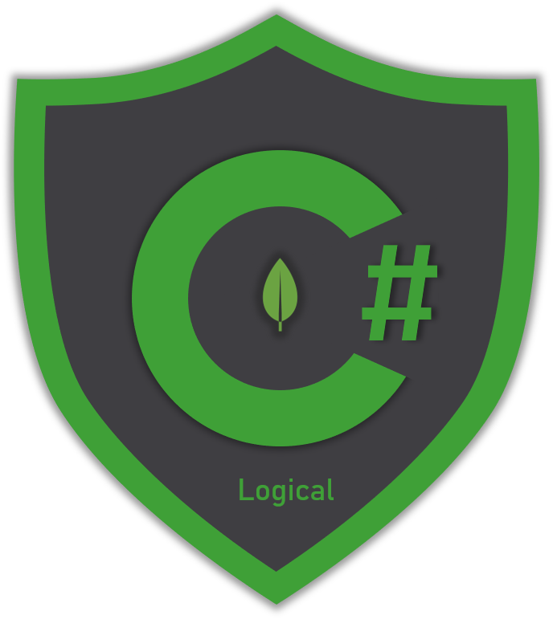

# Logical Operators

## Overview

Logical operators allow you to match documents based on the **boolean result** ✅ ❌ coming from a set of expressions. The logical expressions are evaluated for each document in your filter and if their boolean result matches the expected one _\(true or false\)_ are included or excluded respectively in the returned result. The section contains samples for the following operators:

* **AND** operator
* **NOT** operator
* **OR** operator
* **NOR** operator



## _AND_ operator

The AND _operator_ performs a logical AND on a set of expressions and match documents that satisfy all of them. 

> **Syntax**: `Builders<T>.Filter.And(FilterDefinition<T>[] filters)`

The idea is that you create as many **filter definitions** you want and pass them as an argument to the `And` `FilterDefinitionBuilder` method. 

The sample uses an _And_ operator to find all documents that have male _gender_ **AND** have the _profession_ field equal to "_Doctor_".




```csharp
var collection = database.GetCollection<User>(collectionName);

// create an equality filter on the gender for 'male' (0)
var maleFilter = Builders<User>.Filter
    .Eq(u => u.Gender, Gender.Male);
    
// create an equality filter on profession for 'Doctor'
var doctorFilter = Builders<User>.Filter
    .Eq(u => u.Profession, "Doctor");
    
// compine the filters with AND operator
var maleDoctorsFilter = Builders<User>.Filter
    .And(maleFilter, doctorFilter);

var maleDoctors = await collection.Find(maleDoctorsFilter).ToListAsync();
```




```csharp
var bsonCollection = database.GetCollection<BsonDocument>(collectionName);

var bsonMaleFilter = Builders<BsonDocument>.Filter
    .Eq("gender", Gender.Male);
    
var bsonDoctorFilter = Builders<BsonDocument>.Filter
    .Eq("profession", "Doctor");
    
var bsonMaleDoctorsFilter = Builders<BsonDocument>.Filter
    .And(bsonMaleFilter, bsonDoctorFilter);
    
var bsonMaleDoctors = await bsonCollection
    .Find(bsonMaleDoctorsFilter).ToListAsync();
```



```javascript
db.users.find({ $and: [
    { profession: { $eq: "Doctor"} }, 
    {gender: { $eq: 0} }] })
```



```javascript
// sample matched document
{
	"_id" : ObjectId("5e91e3ba3c1ba62570a67bdd"),
	"gender" : 0, // matched here
	"firstName" : "Ralph",
	"lastName" : "Emard",
	"userName" : "Ralph78",
	"avatar" : "https://s3.amazonaws.com/uifaces/faces/twitter/xripunov/128.jpg",
	"email" : "Ralph62@yahoo.com",
	"dateOfBirth" : ISODate("1967-02-18T00:07:22.546+02:00"),
	"address" : {
		"street" : "3046 Orn Locks",
		"suite" : "Apt. 046",
		"city" : "North Nestorview",
		"state" : "Wyoming",
		"zipCode" : "03620-0321",
		"geo" : {
			"lat" : 54.3724,
			"lng" : 127.4216
		}
	},
	"phone" : "422-441-7773",
	"website" : "neva.name",
	"company" : {
		"name" : "Kilback LLC",
		"catchPhrase" : "Configurable 6th generation encoding",
		"bs" : "transition seamless initiatives"
	},
	"salary" : 4787,
	"monthlyExpenses" : 4546,
	"favoriteSports" : [
		"Darts",
		"American Football",
		"Basketball",
		"Cricket",
		"Boxing",
		"Golf",
		"Beach Volleyball",
		"Ice Hockey",
		"Water Polo",
		"Table Tennis",
		"Tennis",
		"Snooker",
		"Cycling",
		"MMA",
		"Handball"
	],
	"profession" : "Doctor" // matched here
}
```



```csharp
public class User
{
    [BsonId]
    [BsonIgnoreIfDefault] // required for replace documents 
    public ObjectId Id { get; set; }
    public Gender Gender { get; set; }
    public string FirstName {get; set; }
    public string LastName {get; set; }
    public string UserName {get; set; }
    public string Avatar {get; set; }
    public string Email {get; set; }
    public DateTime DateOfBirth {get; set; }
    public AddressCard Address {get; set; }
    public string Phone {get; set; }
    
    [BsonIgnoreIfDefault]
    public string Website {get; set; }
    public CompanyCard Company {get; set; }
    public decimal Salary { get; set; }
    public int MonthlyExpenses { get; set; }
    public List<string> FavoriteSports { get; set; }
    public string Profession { get; set; }
}
```




The _Gender_ property on the `User` class is an `Enum` type and the driver is smart enough 🧙♂ 🦉 to translate it properly when sending the query to MongoDB


You can combine as many filters as you want to an AND operator. The following sample finds all documents that match the following criteria:

1. They have gender _Female_ 👩⚕ 
2. They are either _"Teacher", Nurse" or "Dentist"_  🏫 __🏥 
3. Their salary is between 2000 AND 3200 💰 




```csharp
var collection = database.GetCollection<User>(collectionName);

// female filter - condition 1
var femaleFilter = Builders<User>.Filter.Eq(u => u.Gender, Gender.Female);

// profession filter - condition 2
var teacherOrNurseFilter = Builders<User>.Filter
  .In(u => u.Profession, new[] { "Teacher", "Nurse", "Dentist" });
    
// salary filter - condition 3
var salaryFilter = Builders<User>.Filter.And(
                Builders<User>.Filter.Gte(u => u.Salary, 2000),
                Builders<User>.Filter.Lte(u => u.Salary, 3200));

// combined filter
var combinedFilter = Builders<User>.Filter
                .And(femaleFilter, teacherOrNurseFilter, salaryFilter);
    
var matchedUsers = await collection.Find(combinedFilter).ToListAsync();
```




```csharp
var bsonCollection = database.GetCollection<BsonDocument>(collectionName);

// female filter - condition 1
var bsonFemaleFilter = Builders<BsonDocument>.Filter
    .Eq("gender", Gender.Female);

// profession filter - condition 2
var bsonTeacherOrNurseFilter = Builders<BsonDocument>.Filter
    .In("profession", new[] { "Teacher", "Nurse", "Dentist" });
    
// salary filter - condition 3
var bsonSalaryFilter = Builders<BsonDocument>.Filter.And(
    Builders<BsonDocument>.Filter.Gte("salary", 2000),
    Builders<BsonDocument>.Filter.Lte("salary", 3200)
);

// combined filter
var bsonCombinedFilter = Builders<BsonDocument>.Filter
    .And(bsonFemaleFilter, bsonTeacherOrNurseFilter, bsonSalaryFilter);
    
var bsonMatchedUsers = await bsonCollection
    .Find(bsonCombinedFilter).ToListAsync();
```



```javascript
db.users.find( 
{ $and: [
             { "gender" : 1 },
             { profession: { $in: ["Teacher", "Nurse", "Dentist"]}},
             { $and : [ 
                         { salary: { $gte: 2000 } }, 
                         { salary: { $lte: 3200 }} 
             ] } 
        ]})
```



```javascript
// sample matched document
{
	"_id" : ObjectId("5e9335512013741d0cb64570"),
	"gender" : 1, // matched here
	"firstName" : "Silvia",
	"lastName" : "Rice",
	"userName" : "Silvia6",
	"avatar" : "https://s3.amazonaws.com/uifaces/faces/twitter/solid_color/128.jpg",
	"email" : "Silvia_Rice86@hotmail.com",
	"dateOfBirth" : ISODate("1999-05-20T05:09:46.133+03:00"),
	"address" : {
		"street" : "53815 Flo Creek",
		"suite" : "Apt. 845",
		"city" : "Gibsonburgh",
		"state" : "Vermont",
		"zipCode" : "90988",
		"geo" : {
			"lat" : -11.4545,
			"lng" : 87.8866
		}
	},
	"phone" : "(389) 267-5524",
	"company" : {
		"name" : "Klein, Jacobi and Cormier",
		"catchPhrase" : "Open-architected methodical alliance",
		"bs" : "implement dynamic e-markets"
	},
	"salary" : 2935, // matched here
	"monthlyExpenses" : 3826,
	"favoriteSports" : [
		"Darts",
		"Table Tennis",
		"Baseball",
		"Volleyball",
		"Basketball",
		"Snooker",
		"Tennis",
		"Moto GP",
		"Motor Sport",
		"Boxing",
		"Water Polo",
		"Handball",
		"MMA",
		"Soccer",
		"Cycling"
	],
	"profession" : "Dentist" // matched here
}
```



```csharp
public class User
{
    [BsonId]
    [BsonIgnoreIfDefault] // required for replace documents 
    public ObjectId Id { get; set; }
    public Gender Gender { get; set; }
    public string FirstName {get; set; }
    public string LastName {get; set; }
    public string UserName {get; set; }
    public string Avatar {get; set; }
    public string Email {get; set; }
    public DateTime DateOfBirth {get; set; }
    public AddressCard Address {get; set; }
    public string Phone {get; set; }
    
    [BsonIgnoreIfDefault]
    public string Website {get; set; }
    public CompanyCard Company {get; set; }
    public decimal Salary { get; set; }
    public int MonthlyExpenses { get; set; }
    public List<string> FavoriteSports { get; set; }
    public string Profession { get; set; }
}
```




The inner filter definitions passed as arguments in the **`And`** method can be as complex as you want to.


## _NOT_ operator

The NOT _operator_ performs a logical NOT on an expression and match documents that **don't satisfy** the expression. 

> **Syntax**: `Builders<T>.Filter.Not(FilterDefinition<T> filter)`

The idea is that you create a **filter definition** and pass it as an argument to the `Not` `FilterDefinitionBuilder` method. The boolean expression's result for the matched documents will be **false**, meaning that they don't satisfy the expression.

The sample uses an _Not_ operator to find all documents having male _gender,_ which can be translated as **NOT** _female_.




```csharp
var collection = database.GetCollection<User>(collectionName);

// Negates the internal equality filter
var notMaleFilter = Builders<User>.Filter.Not(
    // equality filter on gender for Male
    Builders<User>.Filter.Eq(u => u.Gender, Gender.Male)
);

var femaleUsers = await collection.Find(notMaleFilter).ToListAsync();
```




```csharp
var bsonCollection = database.GetCollection<BsonDocument>(collectionName);

var bsonNotMaleFilter = Builders<BsonDocument>.Filter
.Not(
    Builders<BsonDocument>.Filter.Eq("gender", Gender.Male)
);

var bsonFemaleUsers = await bsonCollection
    .Find(bsonNotMaleFilter).ToListAsync();
```



```javascript
db.users.find( { gender: { $ne: 0 }}).
```



```javascript
// sample matched document
{
	"_id" : ObjectId("5e9335512013741d0cb64552"),
	"gender" : 1, //matched here
	"firstName" : "Rosie",
	"lastName" : "Okuneva",
	"userName" : "Rosie55",
	"avatar" : "https://s3.amazonaws.com/uifaces/faces/twitter/stefanotirloni/128.jpg",
	"email" : "Rosie6@gmail.com",
	"dateOfBirth" : ISODate("1984-11-29T12:38:37.812+02:00"),
	"address" : {
		"street" : "5668 Sonya Fords",
		"suite" : "Apt. 584",
		"city" : "North Birdieside",
		"state" : "New Jersey",
		"zipCode" : "46111",
		"geo" : {
			"lat" : 50.373,
			"lng" : 175.2369
		}
	},
	"phone" : "867.783.1346 x7152",
	"website" : "ola.biz",
	"company" : {
		"name" : "Schaefer, Lang and Considine",
		"catchPhrase" : "User-friendly regional product",
		"bs" : "incubate mission-critical technologies"
	},
	"salary" : 4409,
	"monthlyExpenses" : 6018,
	"favoriteSports" : [
		"Beach Volleyball",
		"Golf",
		"Soccer",
		"Volleyball",
		"Moto GP",
		"Darts",
		"American Football",
		"Basketball",
		"Snooker",
		"MMA",
		"Motor Sport"
	],
	"profession" : "Visual Designer"
}
```



```csharp
public class User
{
    [BsonId]
    [BsonIgnoreIfDefault] // required for replace documents 
    public ObjectId Id { get; set; }
    public Gender Gender { get; set; }
    public string FirstName {get; set; }
    public string LastName {get; set; }
    public string UserName {get; set; }
    public string Avatar {get; set; }
    public string Email {get; set; }
    public DateTime DateOfBirth {get; set; }
    public AddressCard Address {get; set; }
    public string Phone {get; set; }
    
    [BsonIgnoreIfDefault]
    public string Website {get; set; }
    public CompanyCard Company {get; set; }
    public decimal Salary { get; set; }
    public int MonthlyExpenses { get; set; }
    public List<string> FavoriteSports { get; set; }
    public string Profession { get; set; }
}
```



## _OR_ operator

The _OR_ operator performs a logical OR on an **set of expressions** and match documents that **satisfy** at least on of the expressions. 

> **Syntax**: `Builders<T>.Filter.Or(FilterDefinition<T>[] filters)`

The idea is that you create as many **filter definitions** you want and pass them as an argument to the `Or` `FilterDefinitionBuilder` method. The filters passed as parameters can be as complex as you want.

The sample uses an _Or_ operator to find all documents having _salary,_ either too low _\(less than 1500\)_ or too high _\( greater than 4000\)._




```csharp
var collection = database.GetCollection<User>(collectionName);

// users with salary either < 1500 (too low) or > 4000 (too high)
var orSalaryFilter = Builders<User>.Filter.Or(
    Builders<User>.Filter.Lt(u => u.Salary, 1500), // 1st expression
    Builders<User>.Filter.Gt(u => u.Salary, 4000)  // 2nd expression
);

var lowOrHighSalaryUsers = await collection
    .Find(orSalaryFilter).ToListAsync();
```




```csharp
var bsonCollection = database.GetCollection<BsonDocument>(collectionName);

var bsonOrSalaryFilter = Builders<BsonDocument>.Filter.Or(
    Builders<BsonDocument>.Filter.Lt("salary", 1500),
    Builders<BsonDocument>.Filter.Gt("salary", 4000)
);

var bsonLowOrHighSalaryUsers = await bsonCollection
    .Find(bsonOrSalaryFilter).ToListAsync();
```



```javascript
db.users.find( { $or: [ 
    { salary: { $lt: 1500 } }, 
    { salary: { $gt: 4000 }}
]})
```



```javascript
// sample matched document
{
	"_id" : ObjectId("5e9335512013741d0cb6454a"),
	"gender" : 0,
	"firstName" : "Carlton",
	"lastName" : "Bergstrom",
	"userName" : "Carlton_Bergstrom",
	"avatar" : "https://s3.amazonaws.com/uifaces/faces/twitter/joe_black/128.jpg",
	"email" : "Carlton28@yahoo.com",
	"dateOfBirth" : ISODate("1952-09-18T11:22:04.592+03:00"),
	"address" : {
		"street" : "0021 Sheila Corners",
		"suite" : "Apt. 199",
		"city" : "Schmidtfort",
		"state" : "Rhode Island",
		"zipCode" : "09682",
		"geo" : {
			"lat" : 11.8535,
			"lng" : 102.024
		}
	},
	"phone" : "1-300-468-9739 x188",
	"website" : "weldon.name",
	"company" : {
		"name" : "Dooley, Schmitt and Wiegand",
		"catchPhrase" : "Robust coherent migration",
		"bs" : "empower front-end vortals"
	},
	"salary" : 4005, // matched here (too high)
	"monthlyExpenses" : 3483,
	"favoriteSports" : [
		"Formula 1",
		"Volleyball"
	],
	"profession" : "Personal Trainer"
}
```



```csharp
public class User
{
    [BsonId]
    [BsonIgnoreIfDefault] // required for replace documents 
    public ObjectId Id { get; set; }
    public Gender Gender { get; set; }
    public string FirstName {get; set; }
    public string LastName {get; set; }
    public string UserName {get; set; }
    public string Avatar {get; set; }
    public string Email {get; set; }
    public DateTime DateOfBirth {get; set; }
    public AddressCard Address {get; set; }
    public string Phone {get; set; }
    
    [BsonIgnoreIfDefault]
    public string Website {get; set; }
    public CompanyCard Company {get; set; }
    public decimal Salary { get; set; }
    public int MonthlyExpenses { get; set; }
    public List<string> FavoriteSports { get; set; }
    public string Profession { get; set; }
}
```



## _NOR_ operator

The _NOR_ operator performs a logical NOR on an **set of expressions** and match documents that **fail to satisfy** all the expressions. Despite the fact that MongoDB supports the [$nor](https://docs.mongodb.com/manual/reference/operator/query/nor/) operator, you won't find any method on the C\# driver. That's totally fine though because you can built it using the AND operator and negating the internal filters. 

The idea is that you create as many filter definitions you want **to fail** and pass them as an argument to the `And` `FilterDefinitionBuilder` method. The filters passed as parameters can be as complex as you want.

The sample finds documents that **fail** to satisfy the following criteria:

1. Have _profession_ equal to "Doctor"
2. Have _salary_ less than 4500

Since the matched documents needs to fail the above criteria, you should use their negates with an AND operator.




```csharp
var collection = database.GetCollection<User>(collectionName);

var norFilter = Builders<User>.Filter.And(
    Builders<User>.Filter // negate 1st filter
        .Not(Builders<User>.Filter.Eq(u => u.Profession, "Doctor")),    
    Builders<User>.Filter // negate 2nd filter
        .Not(Builders<User>.Filter.Lt(u => u.Salary, 4500))
);

var norUsers = await collection
    .Find(norFilter).ToListAsync();
```




```csharp
var bsonCollection = database.GetCollection<BsonDocument>(collectionName);

var bsonNorFilter = Builders<BsonDocument>.Filter.And(
    Builders<BsonDocument>.Filter
        .Not(Builders<BsonDocument>.Filter.Eq("profession", "Doctor")),
    Builders<BsonDocument>.Filter
        .Not(Builders<BsonDocument>.Filter.Lt("salary", 4500)));

var bsonNorUsers = await bsonCollection
    .Find(bsonNorFilter).ToListAsync();
```



```javascript
db.users.find(
{ $nor: [ { profession: { $eq: "Doctor" } }, 
          { salary: { $lt: 4500 }}
        ]})
```



```javascript
// sample matched document
{
	"_id" : ObjectId("5e9335512013741d0cb6454e"),
	"gender" : 0,
	"firstName" : "Richard",
	"lastName" : "Hirthe",
	"userName" : "Richard.Hirthe52",
	"avatar" : "https://s3.amazonaws.com/uifaces/faces/twitter/ruzinav/128.jpg",
	"email" : "Richard_Hirthe@gmail.com",
	"dateOfBirth" : ISODate("1999-09-11T11:24:04.010+03:00"),
	"address" : {
		"street" : "785 Adams Dale",
		"suite" : "Suite 379",
		"city" : "Labadiestad",
		"state" : "Texas",
		"zipCode" : "45075",
		"geo" : {
			"lat" : 34.7933,
			"lng" : 70.5508
		}
	},
	"phone" : "977.924.7118",
	"website" : "charlie.net",
	"company" : {
		"name" : "O'Keefe LLC",
		"catchPhrase" : "Triple-buffered maximized database",
		"bs" : "synergize next-generation architectures"
	},
	"salary" : 4603, // matched here
	"monthlyExpenses" : 3355,
	"favoriteSports" : [
		"Snooker",
		"Water Polo",
		"Table Tennis",
		"Ice Hockey",
		"Volleyball",
		"Soccer",
		"Handball",
		"American Football",
		"Golf",
		"Boxing",
		"Beach Volleyball",
		"Formula 1",
		"Tennis",
		"Motor Sport",
		"Baseball"
	],
	"profession" : "Lawyer" // matched here
}
```



```csharp
public class User
{
    [BsonId]
    [BsonIgnoreIfDefault] // required for replace documents 
    public ObjectId Id { get; set; }
    public Gender Gender { get; set; }
    public string FirstName {get; set; }
    public string LastName {get; set; }
    public string UserName {get; set; }
    public string Avatar {get; set; }
    public string Email {get; set; }
    public DateTime DateOfBirth {get; set; }
    public AddressCard Address {get; set; }
    public string Phone {get; set; }
    
    [BsonIgnoreIfDefault]
    public string Website {get; set; }
    public CompanyCard Company {get; set; }
    public decimal Salary { get; set; }
    public int MonthlyExpenses { get; set; }
    public List<string> FavoriteSports { get; set; }
    public string Profession { get; set; }
}
```



💡 Of course you can build a simple extension method that does this for you and makes things a little bit easier.



```csharp
var collection = database.GetCollection<User>(collectionName);

var firstFilterToFail = Builders<User>.Filter
    .Eq(u => u.Profession, "Doctor");
    
var secondFilterToFail = Builders<User>.Filter
    .Lt(u => u.Salary, 4500);
    
var extensionNorFilter = Builders<User>.Filter
    .Nor(firstFilterToFail, secondFilterToFail);
```




```csharp
public static FilterDefinition<T> Nor<T>(
    this FilterDefinitionBuilder<T> builder, 
    params FilterDefinition<T>[] filters)
{
    return builder.And(
        filters.Select(builder.Not)
    );
}
```




